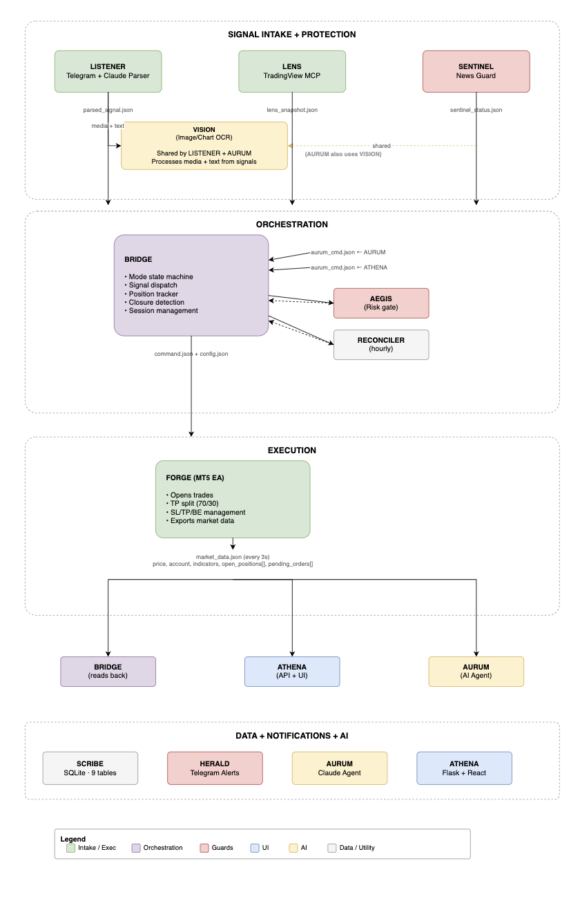

# ⚒ SIGNAL SYSTEM v1.0
> XAUUSD signal-following scalper with AI intelligence layer.
> macOS + MetaTrader 5 native. 12 components. 6 operating modes.

---
## External Dependencies
- **Python 3.11+** (service runtime)
- **Node.js 18+** (TradingView MCP server runtime)
- **MetaTrader 5 (macOS native app)** (FORGE execution + account feed)
- **TradingView Desktop with CDP enabled (`localhost:9222`)** (LENS live indicator source)
- **TradingView MCP server**: `https://github.com/LewisWJackson/tradingview-mcp-jackson.git`
- **Telegram account + Bot API token** (LISTENER intake + HERALD/AURUM notifications)
- **Anthropic API key** (LISTENER parsing + AURUM intelligence layer)
- **Tesseract OCR (optional, recommended for chart image extraction quality)**

For full installation and configuration flow, see [docs/SETUP.md](docs/SETUP.md).

---

## Architecture
Core architecture and operations docs:
- **System architecture**: [docs/ARCHITECTURE.md](docs/ARCHITECTURE.md)
- **Mode architecture**: [docs/MODES_ARCHITECTURE.md](docs/MODES_ARCHITECTURE.md)
- **Scalper rules/tuning**: [docs/FORGE_TRADING_RULES.md](docs/FORGE_TRADING_RULES.md)
- **Vision validation runbook**: [docs/VISION_CLI_RUNBOOK.md](docs/VISION_CLI_RUNBOOK.md)
- **Signal room policy**: [docs/SIGNAL_ROOM_POLICY.md](docs/SIGNAL_ROOM_POLICY.md)
- **Architecture diagram (PNG)**: [docs/assets/trading-system-architecture.png](docs/assets/trading-system-architecture.png)
- **Architecture diagram (interactive HTML)**: [docs/assets/trading-system-architecture.drawio.html](docs/assets/trading-system-architecture.drawio.html)
- **Architecture diagram source (Draw.io)**: [docs/assets/trading-system-architecture.drawio](docs/assets/trading-system-architecture.drawio)
- **Architecture diagram source (XML)**: [docs/assets/trading-system-architecture.xml](docs/assets/trading-system-architecture.xml)

Recent behavior notes:
- Signal-room media uploads are archived and replayable via `scripts/replay_signal_uploads.py`, with channel-aware summary notifications to Telegram.
- FORGE market export includes all account positions using `forge_managed=true/false`.
- BRIDGE logs unmanaged/manual MT5 positions into SCRIBE as `MANUAL_MT5` lifecycle records.


## System Design Rationale (SCRIBE-first)
- The system was designed **SCRIBE-first** so every decision path is auditable before automation scale-up.
- Starting with persistent event/trade logs enabled a safe WATCH-first rollout, then evidence-based progression into live execution modes.
- BRIDGE, AEGIS, FORGE, LISTENER, and AURUM are layered as a closed loop: ingest → validate → execute → reconcile → learn.
- New features (including unmanaged/manual MT5 trade tracking and session/open alert telemetry) are added as schema-backed events to preserve traceability over time.
- Operational query workflows are documented in [docs/SCRIBE_QUERY_EXAMPLES.md](docs/SCRIBE_QUERY_EXAMPLES.md).

## Components
| # | Name | File | Role |
|---|---|---|---|
| 1 | SCRIBE | `python/scribe.py` | SQLite intelligence logger (11 tables, ML/ops-ready) |
| 2 | FORGE | `ea/FORGE.mq5` | MT5 EA — 5 modes, trade groups, backtest |
| 3 | HERALD | `python/herald.py` | Telegram notifications |
| 4 | SENTINEL | `python/sentinel.py` | News guard, economic calendar |
| 5 | LENS | `python/lens.py` | TradingView MCP ([LewisWJackson/tradingview-mcp-jackson](https://github.com/LewisWJackson/tradingview-mcp-jackson.git)) |
| 6 | AEGIS | `python/aegis.py` | Risk manager, N-trade lot sizer |
| 7 | LISTENER | `python/listener.py` | Telegram signal reader + Claude parser |
| 8 | AURUM | `python/aurum.py` | Claude AI agent (`SOUL.md` + `SKILL.md`) |
| 9 | BRIDGE | `python/bridge.py` | Orchestrator + mode state machine |
| 10 | ATHENA | `python/athena_api.py` | Flask API + React dashboard |
| 11 | VISION | `python/vision.py` | Shared chart/image extraction module for LISTENER + AURUM |
| 12 | RECONCILER | `python/reconciler.py` | Hourly MT5↔SCRIBE consistency audit |

## Operating Modes
- **OFF** — Completely dormant
- **WATCH** — Records data only, no trades (ML collection)
- **SIGNAL** — Executes Telegram signals only
- **SCALPER** — BRIDGE scalper + FORGE native scalper
- **HYBRID** — SIGNAL + SCALPER combined
- **AUTO_SCALPER** — AURUM-driven autonomous scalping loop

## Quick Start
```bash
pip3 install -r requirements.txt
cp .env.example .env
# Fill in .env with your credentials
# See docs/SETUP.md for full setup guide
python3 python/bridge.py --mode WATCH
```

## AURUM — Talk to your system
From Telegram:
> "What's my P&L today?"
> "Is the entry for G047 still valid?"
> "Switch to WATCH mode"
> "Show me LENS analysis"

## Data Schema (SCRIBE)
SCRIBE uses 11 SQLite tables, and every row is tagged with `mode` when applicable:
- `system_events` — mode switches, startups, shutdowns
- `trading_sessions` — session windows and rolled-up performance
- `market_snapshots` — OHLCV + indicators (LENS + MT5)
- `signals_received` — every Telegram signal + parse result
- `trade_groups` — parent record for N-trade groups
- `trade_positions` — individual MT5 trade tickets
- `news_events` — SENTINEL guard events + market moves
- `aurum_conversations` — all AURUM queries + responses
- `trade_closures` — SL/TP hit log with inferred close reason
- `component_heartbeats` — per-component liveness
- `vision_extractions` — LISTENER/AURUM image extraction lineage + confidence

## License
For personal use only. Not financial advice. Always test on demo first.
