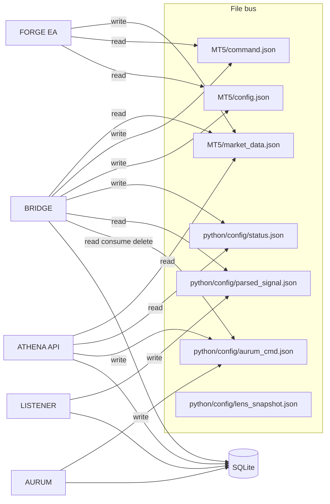

# Signal System — data contract & interchange design

This document defines **how components exchange data** beyond the SQLite DDL. The database schema answers “what we persist”; this contract answers **which JSON shapes move on the file bus and HTTP API**, who produces them, and who consumes them.

**Contract bundle version:** `1.0.0` (see `schemas/manifest.json`). Bump when breaking field renames or required-key changes are introduced.

### Start here (simple picture)

| You care about… | Read / use… |
|-----------------|-------------|
| **Disk JSON** between BRIDGE, FORGE, LISTENER, AURUM | This doc **§3** + `schemas/files/*.schema.json` + `python/contracts/aurum_forge.py` |
| **HTTP** (dashboard, agents) | **`schemas/openapi.yaml`** and, while ATHENA runs, **`GET /api/docs/`** (Swagger UI) and **`GET /api/openapi.yaml`** |

We maintain **one** HTTP contract: **OpenAPI**. We do **not** keep a parallel set of `schemas/http/*.json` files — that would duplicate the spec and drift.

---

## 1. Three layers

| Layer | Role | Examples |
|--------|------|----------|
| **A. Persistence (SQLite)** | Long-lived truth for signals, groups, positions, events, heartbeats, trade closures | `scribe.py` DDL |
| **B. File bus (JSON files)** | Real-time, process-local IPC between BRIDGE, FORGE, LISTENER, ATHENA, AURUM | `MT5/*.json`, `python/config/*.json` |
| **C. HTTP API (ATHENA)** | Dashboard + optional external agents; mostly **read** SCRIBE/files, **write** a few command files | `GET /api/live`, `POST /api/mode` |

**Rule of thumb:** Trading execution is **never** driven only by HTTP. ATHENA mode changes and AURUM commands are **queued as files** for BRIDGE to consume and then BRIDGE writes `MT5/command.json` for FORGE.

---

## 2. Component matrix (who talks to whom)



---

## 3. File bus contracts (authoritative schemas)

Paths are relative to repo root unless noted. Machine-readable definitions live under **`schemas/files/`**.

| File | Writer | Reader | Schema |
|------|--------|--------|--------|
| `MT5/command.json` | BRIDGE | FORGE | `schemas/files/forge_command.schema.json` |
| `python/config/aurum_cmd.json` | AURUM, ATHENA (`POST /api/mode` writes `MODE_CHANGE`) | BRIDGE (reads, acts, **deletes** the file) | `schemas/files/aurum_cmd.schema.json` |
| `python/config/status.json` | BRIDGE | ATHENA (`/api/live`) | `schemas/files/status.schema.json` |
| `MT5/market_data.json` | FORGE | BRIDGE, ATHENA | `schemas/files/market_data.schema.json` |
| `python/config/parsed_signal.json` | LISTENER | BRIDGE | *(documented in LISTENER prompt; extend schema when stable)* |
| `python/config/lens_snapshot.json` | LENS MCP (via `lens.py`) | BRIDGE, ATHENA | *(partial; TV snapshot fields)* |
| `python/config/listener_meta.json` | LISTENER | ATHENA (`/api/channels`, `/api/channels/messages`) | *(see below)* |
| `python/config/channel_names.json` | LISTENER (on connect) | ATHENA | `{ "<chat_id>": "<title>", … }` |
| `python/config/channel_messages.json` | LISTENER (every 5min) | ATHENA | `{ "<chat_id>": [ {date,text,id}, … ], … }` |
`MT5/market_data.json` semantics (current runtime):
- `account.open_positions_count` is account-wide.
- `open_positions[]` exports all account positions and includes `forge_managed` (`true` for FORGE magic-range positions, `false` for manual/non-FORGE).
- `pending_orders[]` exports symbol-scope pending orders and includes `forge_managed`.
- `recent_closed_deals[]` exports recent broker deal closures by position ticket (`position_ticket`, `close_price`, `profit`, `close_reason`, `time_unix`) for broker-exact close attribution in BRIDGE.
- `forge_config` exports active threshold-hardening values:
  - `pending_entry_threshold_points`
  - `trend_strength_atr_threshold`
  - `breakout_buffer_points`

`MT5/scalper_entry.json` semantics (native FORGE scalper):
- emitted by FORGE on native setup trigger (`FORGE_NATIVE_SCALP`)
- consumed by BRIDGE and persisted into SCRIBE `trade_groups`
- includes threshold-hardening fields above plus derived decision metrics (`h1_trend_strength`, `prev_close`, `m5_bb_upper`, `m5_bb_lower`)

`python/config/listener_meta.json` semantics (written by LISTENER):
- `status` — `"OK"` | `"WARN"` (WARN = no message received for > `LISTENER_STALE_THRESHOLD_SEC`, default 600s)
- `last_ingest_at` — ISO-8601 UTC timestamp of the last message that was received and processed (any type, including IGNORE)
- `updated_at` — ISO-8601 UTC of the last meta write
- `channels_count` — number of channels currently monitored
- `signal_trade_rooms_active` — boolean; true if `SIGNAL_TRADE_ROOMS` is non-empty
- `signal_trade_rooms_count` — number of entries in the allowlist
- `resolved_rooms[]` — per-channel allowlist resolution, written once on Telegram connect:
  - `chat_id` — string form of Telethon chat ID
  - `title` — resolved channel title
  - `is_trade_room` — boolean
  - `match_reason` — `ALLOWED_ALL` | `ALLOWED_TITLE_MATCH` | `ALLOWED_ID_MATCH` | `WATCH_ONLY_ROOM_FILTER`

BRIDGE tracker semantics:
- `forge_managed=true` positions follow standard strategy trade-group lifecycle.
- `forge_managed=false` positions are persisted as synthetic manual groups (`trade_groups.source='MANUAL_MT5'`) with `trade_positions`/`trade_closures` rows and audit events `UNMANAGED_POSITION_OPEN` / `UNMANAGED_POSITION_CLOSED`.

**Ephemeral queue:** `aurum_cmd.json` is a **drop box**, not a status file. BRIDGE **removes** it after handling. If the mode already changed, the file is often **gone** — that is **normal**.
In addition to trading/mode actions, `aurum_cmd.json` now supports AEB execution actions:
- `SCRIBE_QUERY` (read-only SQL against SCRIBE; guarded in executor),
- `SHELL_EXEC` (allowlisted host command execution),
- `AURUM_EXEC` (HTTP bridge to `POST /api/aurum/exec`),
- `ANALYSIS_RUN` (deferred async analysis; immediate `query_id` ack, results written to `logs/analysis/<query_id>.{json,md}`, audit `ANALYSIS_QUEUED|DONE|FAILED` in `logs/audit/system_events.jsonl`, and posted to the existing Telegram channel via Herald — see `python/analysis_runner.py` and `docs/ARCHITECTURE.md` § *Deferred Analysis Runs*).
When AURUM emits JSON commands, it stamps `origin_source` (for example `TELEGRAM`, `ATHENA`, `AUTO_SCALPER`).
BRIDGE can block `SHELL_EXEC` by command origin via `AEB_SHELL_EXEC_BLOCKED_SOURCES` (default: `TELEGRAM`), including nested `AURUM_EXEC` payloads that request `SHELL_EXEC`.

**Python validators:** `python/contracts/aurum_forge.py` implements **`validate_aurum_cmd`** and **`validate_forge_command`** aligned with `schemas/files/*.schema.json`. Keep them in sync when the JSON Schema changes.

`MT5/command.json` modify semantics (runtime behavior):
- `{"action":"MODIFY_SL","sl":...}` or `{"action":"MODIFY_TP","tp":...}` without `magic` applies globally to EA-managed exposure.
- When BRIDGE resolves a `group_id`, it writes `magic` into modify commands; FORGE applies the change only to that group's positions/pending orders.
- Optional `ticket` (positive integer) scopes the modification to **one** position or pending. FORGE validates by ticket equality and ignores `magic` mismatches.
- Optional `tp_stage` (`1`, `2`, or `3`) restricts the modification to legs whose FORGE comment matches `|TP<stage>` (the per-leg metadata FORGE writes in `PlaceOpenGroupLeg`). When set together with `magic`, both filters apply (logical AND). Use `tp_stage` to move TP1 without collapsing TP2/TP3 onto it.
- `MT5/market_data.json` `open_positions[]` now includes a `comment` string (FORGE v1.5.0+) with the same grammar (`FORGE|G<id>|<leg_index>|TP<stage>`); BRIDGE parses it to backfill `trade_positions.tp_stage` at fill time so AURUM can introspect leg stages before issuing a scoped MODIFY.

**Copy-paste shapes (minimal valid examples):**

`python/config/aurum_cmd.json` — mode change:

```json
{
  "action": "MODE_CHANGE",
  "new_mode": "WATCH",
  "reason": "operator",
  "timestamp": "2026-04-06T12:00:00+00:00"
}
```

`python/config/aurum_cmd.json` — AEB SQL query:

```json
{
  "action": "SCRIBE_QUERY",
  "sql": "SELECT id, status, timestamp FROM trade_groups ORDER BY id DESC LIMIT 5",
  "reply_to": "TELEGRAM",
  "timestamp": "2026-04-14T19:30:00+00:00"
}
```

`python/config/aurum_cmd.json` — deferred analysis run (returns `query_id` immediately, posts result to Telegram on completion):

```json
{
  "action": "ANALYSIS_RUN",
  "kind": "trade_group_review",
  "params": { "group_id": 56 },
  "notify": { "telegram": true },
  "reason": "operator-requested review",
  "timestamp": "2026-04-30T17:11:00+00:00"
}
```

`MT5/command.json` — close all (FORGE reads this after BRIDGE writes it):

```json
{
  "action": "CLOSE_ALL",
  "timestamp": "2026-04-06T12:00:00Z"
}
```

Full field lists and optional keys: see the matching file in `schemas/files/`.

---

## 4. HTTP API contracts (ATHENA)

**Canonical spec (Swagger / OpenAPI 3):** `schemas/openapi.yaml`  
**Live copy while ATHENA runs:** `GET /api/openapi.yaml`  
**Interactive UI (embedded):** **`GET /api/docs/`** — [flask-swagger-ui](https://github.com/sveint/flask-swagger-ui) loads the same spec in-browser (dependency: `flask-swagger-ui` in `requirements.txt`).

You can still import **`/api/openapi.yaml`** into **Swagger Editor**, **Stoplight**, Postman, or **openapi-generator** for clients and offline docs.

OpenAPI covers **HTTP only**. It does **not** describe the file-bus JSON files (FORGE still reads `command.json` from disk); those stay in `schemas/files/*.schema.json` and `python/contracts/aurum_forge.py`. See **§7** for frameworks that *do* target non-HTTP messaging.

Base URL: `http://<host>:7842` (default). Responses are JSON unless noted.

**Request/response shapes for every route** are defined in **`schemas/openapi.yaml`** (and visible in **`/api/docs/`**). The tables below are a **human index** only.

### 4.1 Read surfaces (dashboard / agents)

| Method | Path | Notes |
|--------|------|--------|
| GET | `/api/health` | Liveness |
| GET | `/api/live` | Aggregates status + MT5 + LENS + SCRIBE + `regime` block (`config/current/transitions/performance`) |
| GET | `/api/regime/current` | Current regime snapshot + rollout config + transition/performance hints |
| GET | `/api/regime/history` | Historical regime snapshots (`limit`, `hours`) |
| GET | `/api/regime/performance` | Regime-conditioned closed-trade summary (`days`) |
| GET | `/api/components` | Synthetic FORGE row from `market_data.json` |
| GET | `/api/mode` | Current `mode` / `effective_mode` from `config/status.json` (read-only; same source as `/api/live`) |
| GET | `/api/components/heartbeat` | JSON “help” only — **POST** ingests a heartbeat (browser GET avoids a blank page) |
| GET | `/api/events` | `limit` capped in code |
| GET | `/api/events/export` | NDJSON stream (audit export) |
| GET | `/api/signals` | Query params `limit`, `days`, `stats` |
| GET | `/api/performance` | Closed-trade stats |
| GET | `/api/pnl_curve` | Cumulative P&amp;L points |
| … | other `GET /api/*` | See OpenAPI + `athena_api.py` |

### 4.2 Write surfaces (commands & side effects)

| Method | Path | Effect |
|--------|------|--------|
| POST | `/api/mode` | Writes **`aurum_cmd.json`** with `MODE_CHANGE` for BRIDGE |
| POST | `/api/components/heartbeat` | Persists heartbeat via SCRIBE |
| POST | `/api/management` | Validates body against `schemas/files/management_cmd.schema.json`, then writes `management_cmd.json` for BRIDGE |
| POST | `/api/aurum/ask` | Body `{ "query": "..." }`; AURUM may write `aurum_cmd.json` from fenced JSON |
| POST | `/api/aurum/exec` | Executes AEB payload (`SCRIBE_QUERY` / `SHELL_EXEC`) through ATHENA shared executor; optional auth via `ATHENA_AURUM_EXEC_SECRET` |
| POST | `/api/scribe/query` | Body `{ "sql": "SELECT ..." }` — read-only SQL (`SELECT`/`WITH`), guarded by read-only SQLite + authorizer. Examples: **`docs/SCRIBE_QUERY_EXAMPLES.md`**, **`schemas/scribe_query_examples.json`** (`make sync-openapi-scribe` → OpenAPI). Optional **`ATHENA_SCRIBE_QUERY_SECRET`**; row cap **`SCRIBE_QUERY_MAX_ROWS`**; response includes **`truncated`** / **`max_rows`** |

**Important:** `POST /api/mode` does **not** switch mode inside Flask; it only enqueues the same file contract as AURUM.

State-mutating ATHENA routes: when `ATHENA_SECRET` is set, POST routes (`/api/mode`, `/api/management`, `/api/exec`, `/api/aurum/exec`) require `X-Athena-Token: <secret>` header. Returns `403` if missing or wrong.

Management validation: `POST /api/management` validates the request body against `schemas/files/management_cmd.schema.json` before writing. Bad payloads return `400 {"error":"validation_failed","intent":"...","details":[...]}`. The validator is backward-compatible — missing schema files fall through to the unvalidated write path.

SCRIBE query limits: queries are restricted to `ALLOWED_SCRIBE_TABLES`: `trade_positions`, `trade_groups`, `signals`, `trade_closures`, `regime_snapshots`, `system_events`. Requests referencing any other table name return a `ValueError` / `400` error. Channel-origin `MODIFY_SL`/`MODIFY_TP` commands without a resolved `group_id`, `ticket`, or `tp_stage` are dropped by BRIDGE before reaching FORGE.

### 4.3 Services vs dev Python (launchd / systemd)

`services/install_services.py` writes **`__SIGNAL_PYTHON__`** into each plist/unit: **`PROJECT/.venv/bin/python`** if that file exists, else env **`SIGNAL_PYTHON`**, else `python3` on **`PATH`**. After **`make venv`** and **`make restart`**, running services match the same venv as **`make test-contracts`** when you use the repo `.venv`. Edit **`python/athena_api.py`** (or other service entrypoints), then **`make restart`** so the process reloads.

### 4.4 Swagger UI in this repo

| URL | Purpose |
|-----|---------|
| `http://localhost:7842/api/docs/` | Swagger UI (HTML) |
| `http://localhost:7842/api/openapi.yaml` | Raw OpenAPI for tools |

---

## 5. Naming & types

- **Modes:** `OFF` | `WATCH` | `SIGNAL` | `SCALPER` | `HYBRID` — must match `bridge.VALID_MODES` and `python/contracts/aurum_forge.py` `VALID_MODES`.
- **Timestamps:** ISO-8601 strings with offset or `Z` where written by Python (`datetime.now(timezone.utc).isoformat()`).
- **Prices:** Numbers in JSON; broker symbol assumed **XAUUSD** in FORGE/BRIDGE docs.
- **IDs:** `group_id` (int), `ticket` (int), SCRIBE row `id` (integer autoincrement).

---

## 6. Evolution & testing

1. **Non-breaking:** add optional keys, new enum values (with code support), new endpoints.
2. **Breaking:** remove/rename required keys, change `action` strings FORGE parses, or change SQLite columns — bump **`schemas/manifest.json`** `version` and update this doc.
3. **Tests:** `make test-contracts` (AURUM→BRIDGE→FORGE Python validators); `pytest tests/api/test_json_schemas.py` validates bundled examples against JSON Schema when `jsonschema` is installed; `pytest tests/api/test_swagger_ui.py` checks `/api/openapi.yaml` and `/api/docs/`; `pytest tests/api/test_scribe_query_examples.py` runs every SQL in `schemas/scribe_query_examples.json` on an empty SCRIBE DB and checks `query_limited`; `pytest tests/api/test_athena_scribe_query_limits.py` covers `/api/scribe/query` auth and payload shape; `pytest tests/api/test_aeb_executor.py` validates secure SCRIBE_QUERY + SHELL_EXEC guardrails; `pytest tests/api/test_athena_aurum_exec_api.py` covers `/api/aurum/exec` happy/error/auth paths; **`pytest tests/api/test_bridge_aurum_cmd.py`** asserts BRIDGE **deletes** `aurum_cmd.json` after handling commands (including AEB actions) and documents duplicate-timestamp early return; `pytest tests/services/test_resolve_signal_python.py` checks service Python resolution; OpenAPI scribe sync idempotency is in `test_schema_bundle_integrity.py`.

---

## 7. File-bus JSON: why not “just Swagger,” and what frameworks *do* apply?

**Swagger / OpenAPI** models **HTTP**: method, path, status, headers, request/response bodies. Your file bus is **not** HTTP — producers **`open()` + `json.dump()`** and consumers **`read()` + `json.load()`** (or MQL5 file I/O). There is no universal standard that is both “Swagger for files” and industry-default the way OpenAPI is for REST.

That does **not** mean everything must be hand-rolled forever. Common patterns:

| Approach | Fits file-bus / IPC? | Notes |
|----------|----------------------|--------|
| **JSON Schema** (+ validators) | Yes | What we use in `schemas/files/` and `python/contracts/`. Same schema language OpenAPI embeds for bodies. |
| **AsyncAPI** | Partial | Designed for **brokers** (MQTT, Kafka, AMQP). You *can* document “file drop” as a quirky channel, but it’s not the primary use case. |
| **CloudEvents** | Partial | Standard **envelope** (`id`, `source`, `type`, `data`); you’d still define `data` with JSON Schema. Good if you unify many event sources later. |
| **Protocol Buffers / Avro** | Yes | Binary contracts; heavier for a JSON+MQL5 stack unless you add codegen for both sides. |
| **Pydantic / dataclasses** | Yes | Python-side models + validation; can export JSON Schema; doesn’t help FORGE MQL5 directly. |
| **Small internal DSL** | Yes | e.g. BRIDGE validates with `validate_forge_command()` before every write — already aligned with schemas. |

**Practical recommendation for this codebase:** keep **OpenAPI + Swagger UI** for ATHENA HTTP; keep **JSON Schema + shared Python validators** for `aurum_cmd` / `command.json`; optionally add **BRIDGE hooks** that call `validate_forge_command` on every write so the “manual” path is enforced in one place.

---

## 8. Related files

| Artifact | Purpose |
|----------|---------|
| `schemas/openapi.yaml` | **OpenAPI 3** — all `/api/*` routes (Swagger ecosystem) |
| `GET /api/openapi.yaml` | Served by ATHENA for tools that need a URL |
| `GET /api/docs/` | **Swagger UI** (flask-swagger-ui) |
| `requirements.txt` | Includes `flask-swagger-ui` |
| `python/contracts/aurum_forge.py` | Runtime validation + `normalize_aurum_open_trade` |
| `schemas/manifest.json` | Bundle version + file list (`files/*` + `openapi.yaml`) |
| `schemas/files/*.schema.json` | File-bus JSON Schema |
| `schemas/scribe_query_examples.json` | Example `SELECT`s for `POST /api/scribe/query` (tested + Swagger examples) |
| `docs/SCRIBE_QUERY_EXAMPLES.md` | Same examples with table reference and curl |
| `scripts/verify_scribe_mode_writes.py` | Narrative + DB histogram for mode vs SQLite |
| `ea/FORGE.mq5` | Ground truth for `command.json` parsing |
